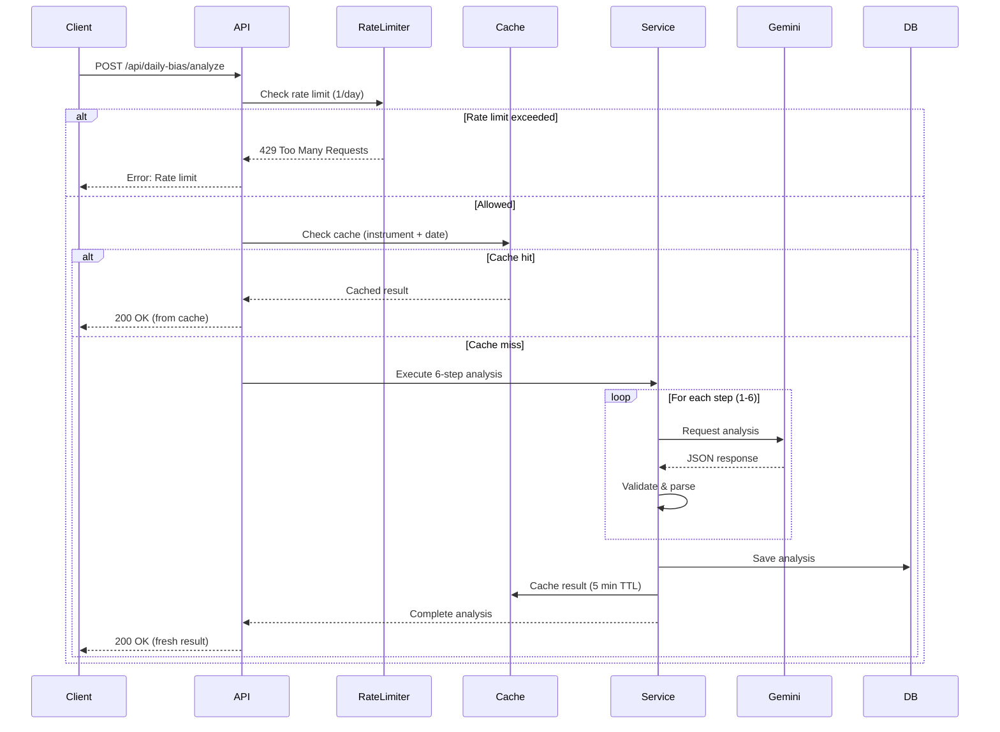
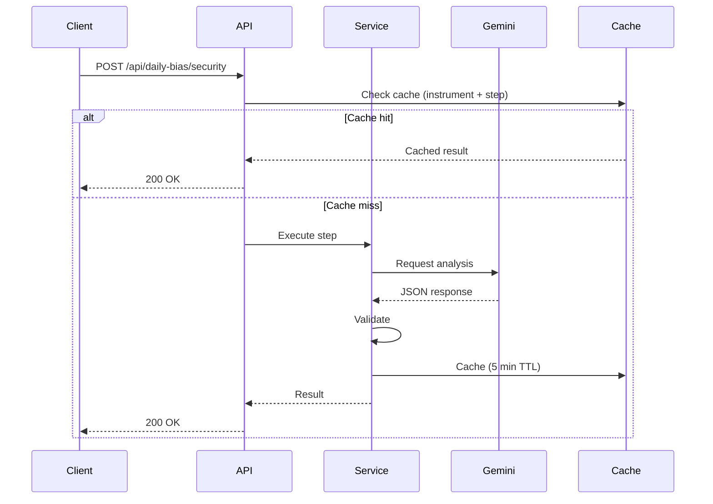

# PRÉ-9.4: Daily Bias API - Documentation Complète

> **Date**: 2026-01-17  
> **Owner**: Dev 71, Dev 23  
> **Status**: ✅ COMPLÉTÉ  
> **Durée**: 4h (estimé)

---

## 📋 TABLE DES MATIÈRES

1. [Vue d'Ensemble](#vue-densemble)
2. [Architecture API](#architecture-api)
3. [Endpoints](#endpoints)
4. [Schémas de Données](#schémas-de-données)
5. [Flux de Requêtes](#flux-de-requêtes)
6. [Authentification & Sécurité](#authentification--sécurité)
7. [Rate Limiting](#rate-limiting)
8. [Gestion des Erreurs](#gestion-des-erreurs)
9. [Exemples d'Utilisation](#exemples-dutilisation)
10. [Monitoring & Performance](#monitoring--performance)

---

## 🎯 VUE D'ENSEMBLE

### Objectif

L'API Daily Bias fournit une analyse AI en 6 étapes pour générer un biais de trading quotidien (Bullish/Bearish/Neutral) sur 21 instruments financiers.

### 6-Step Analysis Framework

```
1. Security Analysis    → Évaluation de la volatilité et des risques
2. Macro Analysis       → Contexte macroéconomique (événements, sentiment)
3. Institutional Flux   → Analyse des flux institutionnels (volume, order flow)
4. Mag 7 Leaders        → Corrélation avec les 7 tech leaders
5. Technical Structure  → Support/Resistance, tendances techniques
6. Synthesis            → Agrégation → Final Bias (Bullish/Bearish/Neutral)
```

### Instruments Supportés (21)

**Futures**: NQ1 (Nasdaq), ES1 (S&P 500)  
**Stocks**: TSLA, NVDA, AMD, AAPL, PLTR, AMZN, MSFT, META  
**ETFs**: SPY, TQQQ, SOXL, QQQ, SQQQ  
**Crypto**: BTC, COIN, MSTR, MARA  
**Forex**: XAU/USD (Gold), EUR/USD  
**Meme Stocks**: GME

---

## 🏗️ ARCHITECTURE API

### Stack Technique

- **Framework**: Next.js 15 App Router
- **AI Provider**: Google Gemini API (preferred) + OpenAI GPT-4o (fallback)
- **Cache**: Redis (5 min TTL)
- **Rate Limiter**: Redis-based (multi-window tracking)
- **Database**: PostgreSQL (Prisma ORM)
- **Validation**: Zod schemas

### Composants Principaux

```typescript
src/
├── app/
│   └── api/
│       └── daily-bias/
│           ├── analyze/route.ts          # POST /api/daily-bias/analyze (6-step complete)
│           ├── security/route.ts         # POST /api/daily-bias/security (Step 1)
│           ├── macro/route.ts            # POST /api/daily-bias/macro (Step 2)
│           ├── flux/route.ts             # POST /api/daily-bias/flux (Step 3)
│           ├── mag7/route.ts             # POST /api/daily-bias/mag7 (Step 4)
│           ├── technical/route.ts        # POST /api/daily-bias/technical (Step 5)
│           ├── synthesis/route.ts        # POST /api/daily-bias/synthesis (Step 6)
│           └── history/route.ts          # GET /api/daily-bias/history (User history)
├── services/
│   └── ai/
│       └── daily-bias-service.ts         # Core service layer
├── lib/
│   ├── prompts/
│   │   ├── daily-bias-prompts.ts         # Security Analysis prompts
│   │   ├── macro-analysis-prompt.ts      # Macro prompts
│   │   ├── institutional-flux.ts         # Institutional Flux prompts
│   │   ├── technical-structure.ts        # Technical Structure prompts
│   │   └── synthesis-prompt.ts           # Synthesis prompts
│   ├── validations/
│   │   └── daily-bias.ts                 # Zod validation schemas
│   └── gemini-production.ts              # Gemini client wrapper
└── types/
    └── daily-bias.ts                     # TypeScript type definitions
```

---

## 🔌 ENDPOINTS

### 1. POST `/api/daily-bias/analyze`

**Description**: Lance une analyse complète en 6 étapes pour un instrument.

**Request**:
```typescript
{
  "instrument": "NQ1", // Required: One of 21 supported instruments
  "userId": "uuid",    // Required: User ID (extracted from session)
  "date": "2026-01-17" // Optional: Analysis date (default: today)
}
```

**Response** (200 OK):
```typescript
{
  "success": true,
  "data": {
    "id": "uuid",
    "instrument": "NQ1",
    "date": "2026-01-17",
    "createdAt": "2026-01-17T10:30:00Z",
    
    // Step 1: Security Analysis
    "securityAnalysis": {
      "volatilityIndex": 65,
      "riskLevel": "HIGH",
      "securityScore": 72,
      "analysis": {
        "summary": "Elevated volatility due to tech sector rotation...",
        "risks": [
          { "risk": "Overnight gap risk", "probability": 0.6, "impact": 0.8 }
        ],
        "recommendations": ["Use wider stops", "Reduce position size"]
      },
      "timestamp": "2026-01-17T10:30:05Z",
      "instrument": "NQ1"
    },
    
    // Step 2: Macro Analysis
    "macroAnalysis": {
      "economicEvents": [
        {
          "event": "CPI Release",
          "time": "08:30",
          "importance": "HIGH",
          "country": "USA",
          "forecast": 3.2,
          "previous": 3.1,
          "impactOnInstrument": "High volatility expected"
        }
      ],
      "macroScore": 6.5,
      "sentiment": "NEUTRAL",
      "analysis": {
        "summary": "Mixed macro environment with inflation concerns...",
        "centralBankPolicy": "Hawkish stance maintained",
        "economicCycle": "PEAK"
      },
      "timestamp": "2026-01-17T10:30:12Z",
      "instrument": "NQ1"
    },
    
    // Step 3: Institutional Flux
    "institutionalFlux": {
      "volumeProfile": {
        "totalVolume": 2500000000,
        "volumeLevel": "HIGH",
        "volumeTrend": "INCREASING",
        "heatMap": [
          { "priceLevel": "21450-21500", "volume": 500000000 }
        ]
      },
      "orderFlow": {
        "netFlow": 150000000,
        "buyPressure": 60,
        "sellPressure": 40,
        "confirmation": "BULLISH"
      },
      "fluxScore": 7.2,
      "timestamp": "2026-01-17T10:30:18Z",
      "instrument": "NQ1"
    },
    
    // Step 4: Mag 7 Leaders
    "mag7Analysis": {
      "correlations": [
        {
          "symbol": "NVDA",
          "correlation": 0.85,
          "priceChange24h": 2.3,
          "sentiment": "BULLISH",
          "influence": 0.9
        }
      ],
      "leaderScore": 8.1,
      "overallSentiment": "BULLISH",
      "timestamp": "2026-01-17T10:30:24Z",
      "instrument": "NQ1"
    },
    
    // Step 5: Technical Structure
    "technicalAnalysis": {
      "supportLevels": [
        { "price": 21400, "strength": 0.8, "type": "PREVIOUS_LOW" }
      ],
      "resistanceLevels": [
        { "price": 21600, "strength": 0.9, "type": "PREVIOUS_HIGH" }
      ],
      "trend": {
        "direction": "UPTREND",
        "strength": 0.75,
        "timeframe": "DAILY"
      },
      "indicators": [
        {
          "name": "50 SMA",
          "value": 21350,
          "signal": "BULLISH_CROSS"
        }
      ],
      "technicalScore": 7.8,
      "timestamp": "2026-01-17T10:30:30Z",
      "instrument": "NQ1"
    },
    
    // Step 6: Synthesis
    "synthesis": {
      "finalBias": "BULLISH",
      "confidence": 78,
      "openingConfirmation": {
        "keyLevels": [21500, 21600],
        "conditions": [
          "Wait for break above 21500 with volume confirmation",
          "Stop loss below 21400 support"
        ],
        "timeframe": "First 30 minutes of market open"
      },
      "summary": "Bullish bias supported by strong Mag 7 correlation...",
      "riskReward": {
        "expectedMove": 100,
        "riskLevel": "MEDIUM",
        "positionSizing": "NORMAL"
      },
      "timestamp": "2026-01-17T10:30:36Z",
      "instrument": "NQ1"
    },
    
    "processingTimeMs": 6500
  }
}
```

**Errors**:
- `400 Bad Request`: Invalid instrument or missing required fields
- `401 Unauthorized`: User not authenticated
- `429 Too Many Requests`: Rate limit exceeded (1 analysis/day per user)
- `500 Internal Server Error`: AI service failure (fallback OpenAI attempted)

---

### 2. POST `/api/daily-bias/security`

**Description**: Lance uniquement l'étape 1 (Security Analysis).

**Request**:
```typescript
{
  "instrument": "NQ1",
  "marketData": {
    "currentPrice": 21450.50,
    "priceChange24h": -125.75,
    "priceChangePercent24h": -0.58,
    "volume24h": 2500000000,
    "high24h": 21600.25,
    "low24h": 21380.00
  }
}
```

**Response** (200 OK):
```typescript
{
  "success": true,
  "data": {
    "volatilityIndex": 65,
    "riskLevel": "HIGH",
    "securityScore": 72,
    // ... (same as securityAnalysis above)
  }
}
```

---

### 3. POST `/api/daily-bias/macro`

**Description**: Lance uniquement l'étape 2 (Macro Analysis).

**Request**:
```typescript
{
  "instrument": "NQ1",
  "economicData": {
    "events": [
      {
        "event": "CPI Release",
        "time": "08:30",
        "importance": "HIGH",
        "country": "USA",
        "forecast": 3.2,
        "previous": 3.1
      }
    ]
  }
}
```

**Response** (200 OK):
```typescript
{
  "success": true,
  "data": {
    "economicEvents": [...],
    "macroScore": 6.5,
    "sentiment": "NEUTRAL",
    // ... (same as macroAnalysis above)
  }
}
```

---

### 4. POST `/api/daily-bias/flux`

**Description**: Lance uniquement l'étape 3 (Institutional Flux).

**Request**:
```typescript
{
  "instrument": "NQ1",
  "volumeData": {
    "totalVolume": 2500000000,
    "buyVolume": 1500000000,
    "sellVolume": 1000000000
  }
}
```

**Response** (200 OK):
```typescript
{
  "success": true,
  "data": {
    "volumeProfile": {...},
    "orderFlow": {...},
    "fluxScore": 7.2
    // ... (same as institutionalFlux above)
  }
}
```

---

### 5. POST `/api/daily-bias/mag7`

**Description**: Lance uniquement l'étape 4 (Mag 7 Leaders).

**Request**:
```typescript
{
  "instrument": "NQ1",
  "mag7Data": {
    "AAPL": { "price": 185.50, "change24h": 1.2 },
    "MSFT": { "price": 420.30, "change24h": 0.8 },
    "NVDA": { "price": 880.75, "change24h": 2.3 },
    // ... other Mag 7 stocks
  }
}
```

**Response** (200 OK):
```typescript
{
  "success": true,
  "data": {
    "correlations": [...],
    "leaderScore": 8.1,
    "overallSentiment": "BULLISH"
    // ... (same as mag7Analysis above)
  }
}
```

---

### 6. POST `/api/daily-bias/technical`

**Description**: Lance uniquement l'étape 5 (Technical Structure).

**Request**:
```typescript
{
  "instrument": "NQ1",
  "chartData": {
    "candles": [
      { "time": "2026-01-17T09:30:00Z", "open": 21450, "high": 21480, "low": 21440, "close": 21470, "volume": 50000 }
      // ... more candles
    ],
    "indicators": {
      "sma50": 21350,
      "sma200": 21200,
      "rsi": 62
    }
  }
}
```

**Response** (200 OK):
```typescript
{
  "success": true,
  "data": {
    "supportLevels": [...],
    "resistanceLevels": [...],
    "trend": {...},
    "technicalScore": 7.8
    // ... (same as technicalAnalysis above)
  }
}
```

---

### 7. POST `/api/daily-bias/synthesis`

**Description**: Lance uniquement l'étape 6 (Synthesis) en utilisant les résultats des 5 étapes précédentes.

**Request**:
```typescript
{
  "instrument": "NQ1",
  "previousSteps": {
    "securityAnalysis": {...},  // From Step 1
    "macroAnalysis": {...},     // From Step 2
    "institutionalFlux": {...}, // From Step 3
    "mag7Analysis": {...},      // From Step 4
    "technicalAnalysis": {...}  // From Step 5
  }
}
```

**Response** (200 OK):
```typescript
{
  "success": true,
  "data": {
    "finalBias": "BULLISH",
    "confidence": 78,
    "openingConfirmation": {...},
    "summary": "...",
    "riskReward": {...}
    // ... (same as synthesis above)
  }
}
```

---

### 8. GET `/api/daily-bias/history`

**Description**: Récupère l'historique des analyses pour un utilisateur.

**Query Parameters**:
- `instrument` (optional): Filter by instrument
- `limit` (default: 30): Number of results
- `offset` (default: 0): Pagination offset

**Response** (200 OK):
```typescript
{
  "success": true,
  "data": {
    "analyses": [
      {
        "id": "uuid",
        "instrument": "NQ1",
        "date": "2026-01-17",
        "finalBias": "BULLISH",
        "confidence": 78,
        "createdAt": "2026-01-17T10:30:36Z"
      }
      // ... more analyses
    ],
    "total": 45,
    "limit": 30,
    "offset": 0
  }
}
```

---

## 📊 SCHÉMAS DE DONNÉES

### Prisma Schema

```prisma
model DailyBiasAnalysis {
  id                   String   @id @default(uuid()) @db.Uuid
  userId               String   @db.Uuid
  instrument           String   // One of 21 supported instruments
  date                 DateTime @db.Date
  
  // 6-Step Analysis Results (JSON fields)
  securityAnalysis     Json?    // SecurityAnalysis type
  macroAnalysis        Json?    // MacroAnalysis type
  institutionalFlux    Json?    // InstitutionalFlux type
  mag7Analysis         Json?    // Mag7Analysis type
  technicalAnalysis    Json?    // TechnicalAnalysis type
  synthesis            Json?    // Synthesis type
  
  // Metadata
  processingTimeMs     Int?     // Total processing time
  aiProvider           String   @default("gemini") // "gemini" or "openai"
  cacheHit             Boolean  @default(false)
  
  createdAt            DateTime @default(now())
  updatedAt            DateTime @updatedAt
  
  user                 User     @relation(fields: [userId], references: [id], onDelete: Cascade)
  
  @@unique([userId, instrument, date])
  @@index([userId])
  @@index([instrument])
  @@index([date])
  @@map("daily_bias_analyses")
}
```

### User Model Update

```prisma
model User {
  // ... existing fields
  dailyBiasAnalyses DailyBiasAnalysis[]
}
```

---

## 🔄 FLUX DE REQUÊTES

### Analyse Complète (6-Step)



### Étape Individuelle (Security, Macro, etc.)



---

## 🔐 AUTHENTIFICATION & SÉCURITÉ

### Authentification

**Méthode**: Supabase Auth (JWT tokens)

**Headers Requis**:
```typescript
{
  "Authorization": "Bearer <supabase-jwt-token>",
  "Content-Type": "application/json"
}
```

**Validation**:
```typescript
// In API route
import { requireAuth } from '@/lib/auth';

export async function POST(req: Request) {
  const user = await requireAuth(req);
  if (!user) {
    return Response.json({ error: 'Unauthorized' }, { status: 401 });
  }
  // ... rest of handler
}
```

### Autorisations

**Role-Based Access**:
- **User** (default): 1 analysis/day per instrument
- **Admin** (`isAdmin: true`): Unlimited analyses

**Check Admin**:
```typescript
const isAdmin = user.role === 'ADMIN' || user.email?.endsWith('@admin.com');
```

### Validation des Inputs

**Zod Schemas**:
```typescript
import { z } from 'zod';

const analyzeRequestSchema = z.object({
  instrument: z.enum([
    'NQ1', 'ES1', 'TSLA', 'NVDA', 'SPY', 'TQQQ', 'AMD', 'AAPL',
    'XAU/USD', 'PLTR', 'SOXL', 'AMZN', 'MSTR', 'EUR/USD', 'QQQ',
    'MSFT', 'COIN', 'BTC', 'META', 'GME', 'SQQQ', 'MARA'
  ]),
  date: z.string().regex(/^\d{4}-\d{2}-\d{2}$/).optional()
});

// Usage
const result = analyzeRequestSchema.safeParse(req.body);
if (!result.success) {
  return Response.json({ error: result.error }, { status: 400 });
}
```

---

## ⏱️ RATE LIMITING

### Limites Par Défaut

**Users**:
- 1 analyse complète (6-step) par jour par instrument
- 10 analyses individuelles (single-step) par heure
- 100 requêtes GET /history par jour

**Admins**:
- Unlimited

### Implémentation

**Redis-based Multi-Window Tracker**:
```typescript
import { GeminiRateLimiter } from '@/lib/gemini-rate-limiter';

const rateLimiter = new GeminiRateLimiter({
  redis: redisClient,
  limits: {
    perSecond: 10,
    perMinute: 60,
    perHour: 600,
    perDay: 1 // For full analyses
  }
});

// Check limit
const allowed = await rateLimiter.checkLimit({
  userId: user.id,
  instrument,
  requestType: 'full-analysis'
});

if (!allowed) {
  return Response.json({ 
    error: 'Rate limit exceeded. 1 analysis per day per instrument allowed.' 
  }, { status: 429 });
}
```

### Headers de Réponse

```typescript
{
  "X-RateLimit-Limit": "1",
  "X-RateLimit-Remaining": "0",
  "X-RateLimit-Reset": "1705536000" // Unix timestamp
}
```

---

## ❌ GESTION DES ERREURS

### Format Standard

```typescript
{
  "success": false,
  "error": {
    "code": "RATE_LIMIT_EXCEEDED",
    "message": "You have reached your daily analysis limit for NQ1. Next available: 2026-01-18 00:00 UTC.",
    "details": {
      "instrument": "NQ1",
      "nextAvailable": "2026-01-18T00:00:00Z"
    }
  }
}
```

### Codes d'Erreur

| Code | HTTP Status | Description |
|------|-------------|-------------|
| `UNAUTHORIZED` | 401 | User not authenticated |
| `INVALID_INSTRUMENT` | 400 | Instrument not in supported list |
| `RATE_LIMIT_EXCEEDED` | 429 | Daily/hourly limit reached |
| `AI_SERVICE_ERROR` | 500 | Gemini/OpenAI API failure |
| `VALIDATION_ERROR` | 400 | Invalid request body |
| `CACHE_ERROR` | 500 | Redis cache unavailable (non-blocking) |
| `DATABASE_ERROR` | 500 | PostgreSQL write failure |
| `INVALID_JSON_RESPONSE` | 500 | AI returned malformed JSON |
| `TIMEOUT_ERROR` | 504 | AI request timeout (>30s) |

### Fallback Strategy

**AI Provider Fallback**:
```
1. Try Gemini API
   ↓ (if fails after 3 retries)
2. Try OpenAI GPT-4o
   ↓ (if fails)
3. Return cached result (if available within 24h)
   ↓ (if no cache)
4. Return error to client
```

---

## 💡 EXEMPLES D'UTILISATION

### JavaScript/TypeScript Client

```typescript
// Full 6-step analysis
async function analyzeDailyBias(instrument: string) {
  const response = await fetch('/api/daily-bias/analyze', {
    method: 'POST',
    headers: {
      'Authorization': `Bearer ${token}`,
      'Content-Type': 'application/json'
    },
    body: JSON.stringify({ instrument })
  });
  
  if (!response.ok) {
    const error = await response.json();
    throw new Error(error.error.message);
  }
  
  const result = await response.json();
  return result.data;
}

// Usage
try {
  const analysis = await analyzeDailyBias('NQ1');
  console.log('Final Bias:', analysis.synthesis.finalBias); // "BULLISH"
  console.log('Confidence:', analysis.synthesis.confidence); // 78
} catch (error) {
  console.error('Analysis failed:', error.message);
}
```

### React Hook

```typescript
import { useState } from 'react';

export function useDailyBias(instrument: string) {
  const [loading, setLoading] = useState(false);
  const [error, setError] = useState<string | null>(null);
  const [analysis, setAnalysis] = useState<DailyBiasAnalysis | null>(null);
  
  const analyze = async () => {
    setLoading(true);
    setError(null);
    
    try {
      const response = await fetch('/api/daily-bias/analyze', {
        method: 'POST',
        headers: { 'Content-Type': 'application/json' },
        body: JSON.stringify({ instrument })
      });
      
      if (!response.ok) {
        const err = await response.json();
        throw new Error(err.error.message);
      }
      
      const result = await response.json();
      setAnalysis(result.data);
    } catch (err: any) {
      setError(err.message);
    } finally {
      setLoading(false);
    }
  };
  
  return { analysis, loading, error, analyze };
}

// Component usage
function DailyBiasCard({ instrument }: { instrument: string }) {
  const { analysis, loading, error, analyze } = useDailyBias(instrument);
  
  return (
    <div>
      <button onClick={analyze} disabled={loading}>
        {loading ? 'Analyzing...' : 'Analyze'}
      </button>
      
      {error && <p className="text-red-500">{error}</p>}
      
      {analysis && (
        <div>
          <h3>Final Bias: {analysis.synthesis.finalBias}</h3>
          <p>Confidence: {analysis.synthesis.confidence}%</p>
        </div>
      )}
    </div>
  );
}
```

### Server Action (Next.js)

```typescript
'use server';

import { requireAuth } from '@/lib/auth';
import { analyzeDailyBias } from '@/services/ai/daily-bias-service';

export async function requestDailyBiasAnalysis(instrument: string) {
  const user = await requireAuth();
  
  try {
    const analysis = await analyzeDailyBias({
      userId: user.id,
      instrument,
      date: new Date().toISOString().split('T')[0]
    });
    
    return { success: true, data: analysis };
  } catch (error: any) {
    return { success: false, error: error.message };
  }
}
```

---

## 📈 MONITORING & PERFORMANCE

### Métriques Clés

**Performance**:
- API Latency (p50, p95, p99)
- AI Processing Time (per step)
- Cache Hit Rate
- Database Query Time

**Business**:
- Analyses per Day (total, per instrument)
- Rate Limit Hits
- User Adoption Rate
- AI Provider Usage (Gemini vs OpenAI fallback)

**Reliability**:
- Error Rate (per error code)
- AI Service Uptime
- Cache Availability
- Database Availability

### Logging

**Request Logging**:
```typescript
logger.info('Daily Bias Analysis Started', {
  userId: user.id,
  instrument,
  date,
  requestId: crypto.randomUUID()
});

logger.info('Daily Bias Analysis Completed', {
  userId: user.id,
  instrument,
  processingTimeMs: 6500,
  cacheHit: false,
  aiProvider: 'gemini'
});
```

**Error Logging**:
```typescript
logger.error('AI Service Failure', {
  userId: user.id,
  instrument,
  error: error.message,
  provider: 'gemini',
  fallbackAttempted: true
});
```

### SLA Targets

**Latency**:
- p95 < 10s (6-step analysis)
- p95 < 2s (single-step analysis)
- p95 < 100ms (GET /history)

**Availability**:
- API Uptime: 99.9%
- Cache Uptime: 99.5% (non-blocking failures)
- AI Service: 99% (with fallback)

**Rate Limiting**:
- False Positive Rate: <0.1% (legitimate requests blocked)

---

## 📝 CHANGELOG

### v1.0 (2026-01-17)

**Initial Release**:
- ✅ 6-step analysis framework
- ✅ 21 instruments supported
- ✅ Google Gemini + OpenAI fallback
- ✅ Redis caching (5 min TTL)
- ✅ Rate limiting (1/day per instrument)
- ✅ Complete API documentation
- ✅ TypeScript types & Zod validation
- ✅ Prisma schema ready

**Future Enhancements**:
- [ ] Webhook support (notify on analysis complete)
- [ ] Batch analysis (multiple instruments at once)
- [ ] Historical analysis (backfill past dates)
- [ ] Export to PDF/CSV
- [ ] Real-time updates (WebSocket)
- [ ] Advanced filtering (/history endpoint)
- [ ] A/B testing framework (prompt variations)

---

## 🔗 RÉFÉRENCES

**Documents Connexes**:
- [PRÉ-9.1: JSON Schema Design](./daily-bias-schema.md)
- [PRÉ-9.2: TypeScript Types](../../src/types/daily-bias.ts)
- [PRÉ-9.3: Zod Validation](../../src/lib/validations/daily-bias.ts)
- [OpenAPI Spec](./openapi-daily-bias.yaml)

**External APIs**:
- [Google Gemini API Docs](https://ai.google.dev/docs)
- [OpenAI GPT-4o Docs](https://platform.openai.com/docs/models/gpt-4o)
- [ForexFactory API](https://www.forexfactory.com/)

---

**Document Status**: ✅ COMPLÉTÉ  
**Last Updated**: 2026-01-17  
**Owner**: Dev 71, Dev 23  
**Reviewers**: PM (John), Tech Lead
